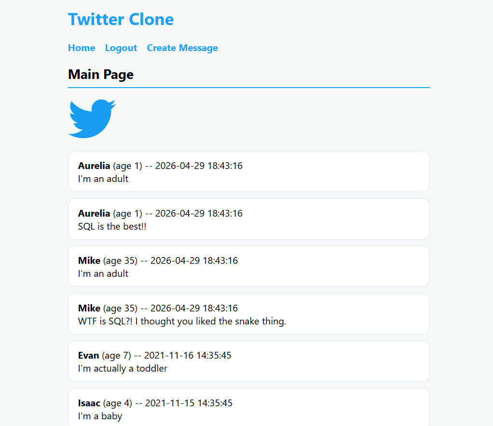

# Twitter Clone

A simple Twitter-like web app built with FastAPI, Jinja2, and SQLite.

## Screenshot



## Features

- View all messages on the home page, sorted newest first
- Each message displays the text, timestamp, username, and age of the poster
- Login/logout functionality via cookies
- User and message creation pages
- Styled with custom CSS served from static files


## Setup
## Setup

**1. Install dependencies:**

```bash
pip install fastapi uvicorn jinja2
```

**2. Create the database:**
```bash
python db_create.py
```

**3. Run the app:**
```bash
python main.py
```

**4. Open in browser:**
```
http://127.0.0.1:8080
```

## Routes

| Route | Description |
|-------|-------------|
| `/` | Home page, displays all messages |
| `/login` | Login with username and password |
| `/logout` | Clears login cookies |
| `/create_message` | Create a new message |
| `/create_user` | Create a new user |

## Dependencies

- Python 3.x
- FastAPI
- Uvicorn
- Jinja2
- SQLite3 (built into Python)